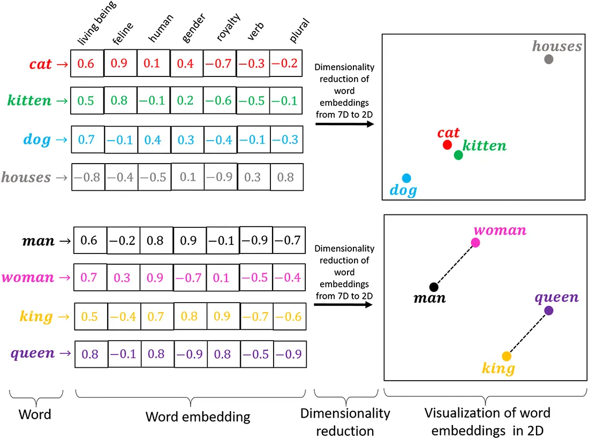
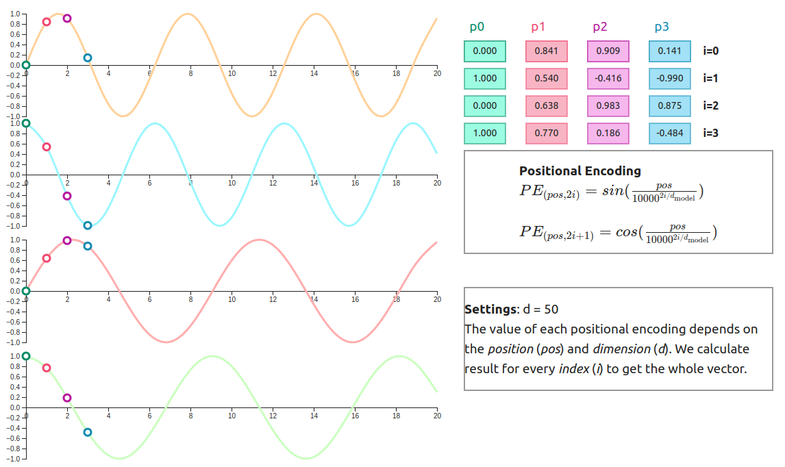
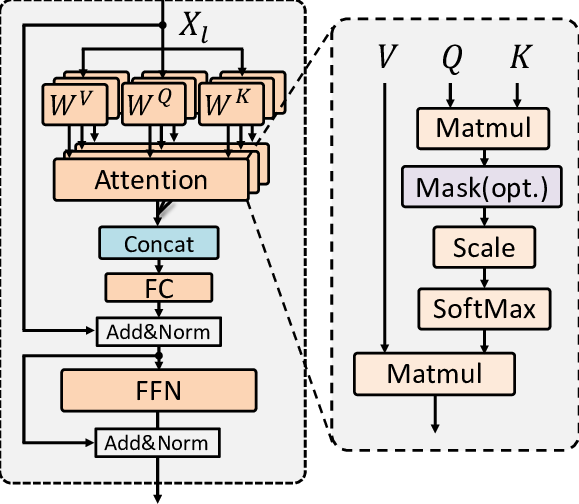
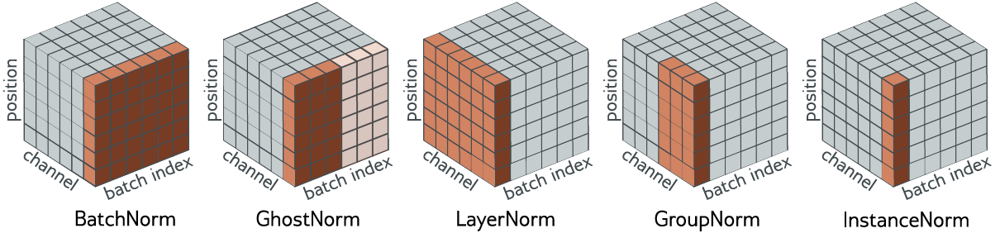
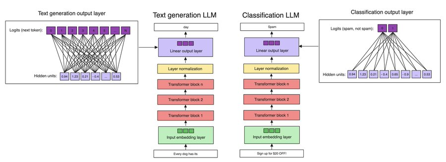

# GPT-2 From Scratch in PyTorch

A clean, minimal re-implementation of **GPT-2** built entirely from scratch in PyTorch.  
This project demonstrates the core building blocks of transformer architectures, including multi-head causal attention, layer normalization, and autoregressive text generation.

---

## 🚀 Features
- **Custom Transformer Implementation**  
  - Causal multi-head self-attention  
  - Pre-LayerNorm residual connections  
  - Position-wise feedforward (MLP with GELU)  
- **GPT-2 Architecture**  
  - Token & positional embeddings  
  - Configurable number of layers, heads, and context length  
  - Final projection to vocabulary logits  
- **Autoregressive Text Generation**  
  - Greedy or temperature-scaled sampling  
  - Top-k filtering for diversity  
  - Early stopping with EOS token  
- **Weight Loading from TensorFlow Checkpoints**  
  - Convert and load pretrained GPT-2 weights into this PyTorch model
- **Fine-Tuning the custom GPT for AGNews Classification**
  - The pre-trained model is adapted with a classification head for prediction

## 🏗 GPT-2 Architecture Components

The GPT-2 model in this project is built from scratch and consists of the following key components:
### 1. Token Embeddings
- Converts input token IDs into dense vectors.
- Captures semantic information for each token in a continuous space.

---

### 2. Positional Embeddings
- Adds information about token position in the sequence.
- Ensures the model is aware of token order since transformers are permutation-invariant.

---

### 3. Transformer Blocks
Each transformer block contains:

- **Layer Normalization (Pre-LN)**  
  Normalizes inputs before attention and feedforward layers for stable training.

- **Causal Multi-Head Self-Attention**  
  Computes attention scores between tokens while masking future tokens to maintain autoregressive property.

- **Feedforward Network (MLP)**  
  Two-layer network with GELU activation. Expands and projects features to embedding size.

- **Residual Connections**  
  Add the input back to the output of attention and feedforward layers to aid gradient flow.

---

### 4. Final Layer Normalization
- Normalizes the output of the last transformer block before the output head.

---

### 5. Output Head
- **Language Modeling Head:** Projects hidden states to vocabulary logits for text generation.
- **Classification Head (Optional):** Projects hidden states to class probabilities for downstream tasks like AGNews classification.

---

### 6. Generation Components
- **Autoregressive Sampling:** Generates tokens one by one based on previous tokens.
- **Temperature and Top-k Filtering:** Controls randomness and diversity during generation.
- **Early Stopping:** Stops generation when EOS token is produced.

---

## 🛠 Tech Stack

| Tool / Library | Version |
|----------------|---------|
| Python         | 3.11+   |
| PyTorch        | 2.4.1   |
| tiktoken       | 0.4.0   |
| Pandas         | 2.1.0   |
| NumPy          | 1.26.0  |
| Matplotlib     | 3.8.0   |
| TQDM           | 4.66.1  |
| CUDA Toolkit   | 12.4    |
| Git            | 2.42+   |
